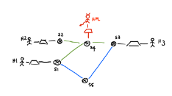

# computer-network-performance-project

Using the Mininet APIs, build the following custom topology:

You can set the link attributes (bandwidth, delay, queue size) individually for the different links of the topology. Set the bandwidth of the green links to twice the value of the blue ones.

Use any tool you want to measure the performance between **H1** and **H3** assuming that the controller establishes that path **p1 = <H1, S1, S4, S3, H3>** should be used for all flows with a unique rule, initially configured in any of the involved switches.

You need to measure the path p1 bandwidth B and the total latency T in both directions H1->H3 and H3->H1.

Consider a total traffic rate λ13, create a plot (Plot 1) that shows how the latency T increases by injecting an increasing rate λ13. Show what happens when λ13 approaches the path p1 bandwidth B and motivate the observation.

You are now required to simulate a denial of service attack performed by host HM, so that S4 adds an intolerable delay to any communication passing through it. Do so by saturating the flow table of S4 (this can be done by altering the MAC address of the sender, but you can simply use the priority field in the flow rules to generate multiple rules for the same pair of communicating hosts) through malicious flows from host HM to host H2 with total rate λM2.

Have the attack start 10 minutes after the delivery of the first packet of flow λ13.

**Attack detection**: Use a timeline plot (Plot 2) to show the increase in the latency T observed between H1 and H3 as a consequence of the ongoing attack.

**Redirection**: Along a separate channel, H1 triggers the intervention of the controller, which will reroute the flow between H1 and H3, through the lower bandwidth path p2 = <H1, S1, S5, S3, H3>, which bypasses the attacked network components.
Use another timeline plot (Plot 3) to show the system behavior when it first discovers the attack and later reacts to it by redirecting the flow along p2.

**Recovery**: Have the controller block the maliciuos traffic after the redirection and dynamically re-establish the more convenient route along path p1. Show the entire scenario in a final timeline plot (Plot 4).
You can merge the observation of the three phases in a unique plot, provided that there is sufficient time between the related events to observe the consequences of the related events on the end-to-end perceived latency between H1 and H3.
